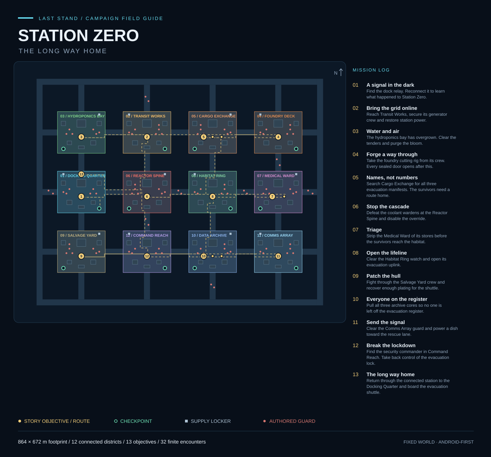

# Station Zero — The Long Way Home

**One fixed, continuous Android campaign world.** The shipping app no longer
asks the player to choose an arena, mode or seed. The legacy arena scenes remain
in the repository for regression testing, not as the default app flow.



This diagram is generated from the same coordinates used by the game. It is a
map overview, **not a captured Godot/Android gameplay screenshot**.

## Play flow

1. **New Campaign** starts at the Docking Quarter. Replacing an existing campaign
   requires confirmation; settings, banked credits and permanent Armory ranks stay.
2. Explore the connected station with the left stick; hold/drag FIRE to aim/shoot.
   Reload, dodge, swap and skills keep their existing independent touch controls.
3. Follow the mission/distance display or open **MAP** for a north-up station
   chart and navigable route. Guarded objectives guide you to remaining guards,
   then to the console. The map pauses simulation; Back returns to Pause.
4. Approach a marked console, manifest or supply locker and tap **INTERACT**.
   Distance, current objective, prior claims and required encounter clears are
   checked by the director, not trusted to the button.
5. Green rest pads save a named checkpoint and restore health/stamina when nearby
   threats are absent. Completing a story objective also advances the checkpoint
   to that district. **Continue / Retry** restore the checkpoint and saved build.
6. Complete extraction back at the docks. **Explore Station** reopens the same
   completed world without repeating the ending or rewards.

Optional development-host controls: **G** interacts, **M** opens the map. These
are not needed on Android and do not replace the existing Q/E/F skill bindings.

## Authored world

| Property | Current content |
|---|---|
| Bounds | 352 × 272 m footprint, centred at the station origin |
| Districts | Docking Quarter, Transit Works, Cargo Exchange, Reactor Spine, Habitat Ring, Command Reach |
| Physical decks | 13 floor rectangles / 744 instanced 8 m modules |
| Connections | Four short horizontal bridges and three long north–south service causeways |
| Landmarks | 24 solid props: shuttle, freight, workshops, crane, reactor/cooling, habitat pods, antenna/servers |
| Story | Seven missions, including three cargo manifests and a return to the docks |
| Interactions | Nine story points plus six optional supply lockers |
| Encounters | Eight finite groups / 29 uniquely identified enemies |
| Commander | Three authored phases; slam, charge and shockwave, no summons |
| Navigation | 4 m cells, 88 × 68 = 5,984 allocated cells; 2,505 connected walkable cells |
| Activation budget | At most 18 living active enemies; at most two new actors per 0.3 s tick |
| Visual budget | At most three nearby district roots; depth fog hides distant culling |

All corridors remain physically connected. There are no chapter teleports or
separate district scene loads. The large empty spaces on the chart are void,
**not** a giant walkable rectangular arena. Outer rails are constructed from the
floor union, so shared deck edges are not accidentally walled shut.

The route is:

1. **A signal in the dark** — reconnect the docking relay.
2. **Bring the grid online** — secure Transit Works and restore power.
3. **Names, not numbers** — recover three evacuation manifests in Cargo Exchange.
4. **Stop the cascade** — defeat the coolant wardens and override the reactor.
5. **Open the lifeline** — secure the Habitat Ring and reconnect its uplink.
6. **Break the lockdown** — defeat the security commander and access the lock.
7. **The long way home** — return through the station and board the shuttle.

## Save and lifecycle rules

- Save schema **8** adds a versioned `campaign` block; old settings, ranks, credits,
  achievements and legacy results remain intact. Old profiles start with an
  unstarted campaign rather than interpreting an old wave count as story progress.
- Named checkpoints replace arbitrary saved transforms. The saved build contains
  validated upgrades, XP and equipped weapon/skill IDs; XP restores silently and
  permanent bonuses are applied once, after restoring upgrade modifiers.
- Completed target/defeat IDs are the persistent ledger. Continue reconciles the
  mission cursor and known IDs against the authored content, dropping malformed
  future/unknown markers instead of leaving an inaccessible objective.
- Mission/cache claims and rewards are staged into the **same whole-profile save**.
  Kill rewards use the existing debounce; objectives, caches, checkpoints,
  pause/death and leaving flush. Legacy run-end reward banking is skipped.
- Defeated actors never respawn on Continue. **Streaming out is not a kill** and
  grants nothing. Unfinished enemies may return at their authored position with
  fresh health; partial enemy damage is not checkpoint state.
- Rest pads refill health/stamina. Retry also resets transient ammunition/cooldowns.
  Uncollected random combat drops are transient; claimed supply lockers persist.
  Campaign currency pickups bank credits; legacy score pickups become XP.
- A failed write shows a warning and retains the dirty profile for retry. A failed
  initial New Campaign write restores the previous campaign in memory. Filesystem
  power-loss durability still needs device testing; see [save resilience](../SAVE_RESILIENCE.md).
- Opaque menus hide the 3D world and suspend automatic quality sampling. Pause and
  safe-area changes cancel thumb/camera ownership. Returning to the menu drains
  run pools and tears down even a partially failed world build.

## Implementation map

- `data/campaign/station_zero.json` — fixed coordinates, district metadata,
  interactions, encounters and mission rewards. It is content, not a generator.
- `scripts/campaign/campaign_definition.gd` — fail-closed data loader and lookups.
- `campaign_geometry.gd` / `campaign_world.gd` — instanced decks, colliders,
  landmarks, floor-union perimeter, navigation and district culling.
- `campaign_encounters.gd` — finite nearby activation and stable defeated IDs.
- `scenes/campaign/security_commander.tscn` — inherited robot/boss scene with
  finite `BossPhaseConfig` resources (no untracked reinforcements).
- `campaign_director.gd` / `campaign_progress.gd` — story authority, loadout,
  checkpoint restore, route targets and persistence.
- `campaign_game.gd` / `scenes/campaign/station_zero.tscn` — shipping composition;
  reuses combat/player/audio/effects without constructing `WaveManager`.
- `campaign_ui.gd`, `campaign_hud.gd`, `campaign_map.gd`, `campaign_armory.gd` —
  touch navigation, objectives, world chart, retries and permanent equipment.
- `tool/validate_campaign.py` — offline schema, references, connectivity and
  clearance checks; reproducible SVG overview.

## Authoring and validation

Edit the JSON directly. Keep floor rectangle coordinates/dimensions on the 8 m
module grid, all identifiers unique/stable and checkpoint pads at least 24 m from
initial guard positions. The 4 m nav grid inflates props by 2.5 m, so an apparently
clear visual point can still be invalid for navigation. Do not add summoning or
splitting populations without extending the finite ledger/budget contract.

```bash
# Offline; no engine, SDK, network or extra Python package needed.
python3 tool/validate_campaign.py
python3 tool/validate_campaign.py --svg docs/campaign/STATION_ZERO_MAP.svg
python3 -m unittest discover -s tests/python

# With the pinned Godot engine installed: import, isolated profile, timeout,
# real shipping scene/controllers, strict engine log + nonempty success summary.
bash scripts/run_campaign_validation.sh

# Full Android build/package checks and real-device follow-up.
bash scripts/build_android.sh
ANDROID_SERIAL=<device-serial> bash scripts/device_qa.sh
```

Both export presets include the JSON explicitly. The APK checker opens the actual
packaged world, checks topology/content and records its SHA-256 in the packaging
report. The native campaign suite is registered in CI and the local Android build;
legacy unit/UI suites remain registered as regressions.

## Validation status — 2026-09-12

**Executed in this workspace:**

- Campaign topology/content checks passed, including every one of the six
  checkpoints, 15 interactions and 29 spawn positions. All 2,505 walkable cells
  form one connected component. One obstructed transit spawn was corrected.
- **1,130 Python tests passed**, including campaign topology mutations,
  bootstrap/persistence/touch contracts and APK campaign-content fixtures.
- GDScript lint and offline resource, engine-API, scene-path, string-format,
  signal, typed-architecture and guard checks passed. Advisory unsafe/dynamic
  access warnings are reported by the existing contract tools, not suppressed.
- The overview was generated and inspected as a diagram.

**Not executed here:**

- The new native campaign/unit/integration suites. Their wrapper correctly
  returned **NOT TESTED / exit 2** because no Godot binary is installed.
- Android APK export/install, actual device touches, Mobile/Vulkan rendering,
  thermal/frame-time measurements, long traversal and force-stop durability.
  No Android SDK/Java/adb/device is available in this workspace.

Earlier native audit evidence in `docs/godot-runs/audit-2026-09-11/` predates these
campaign changes. It is **not** validation of this world. Complete the expanded
[Android device checklist](../DEVICE_QA.md) before shipping an APK.
